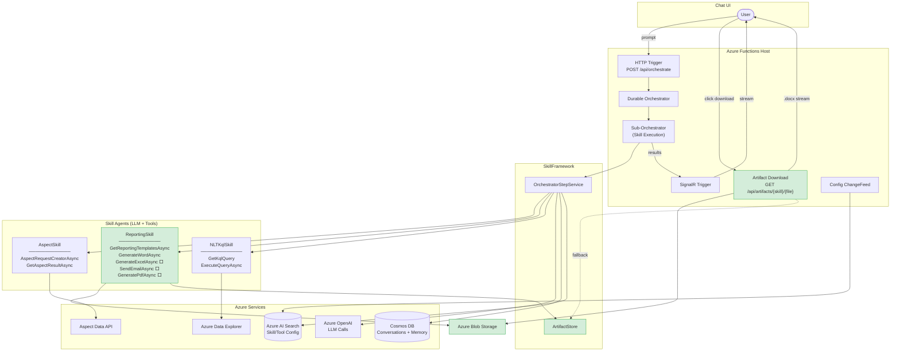
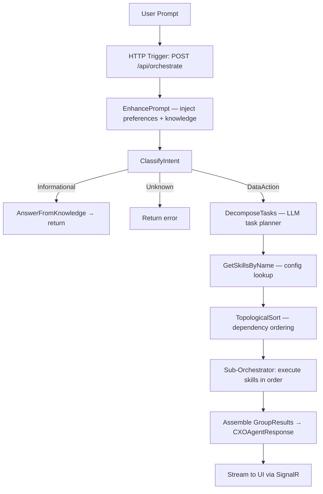
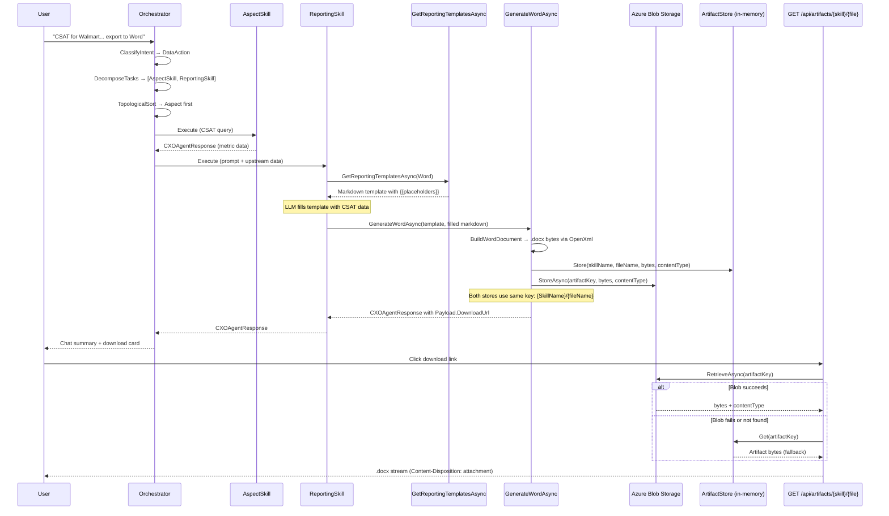
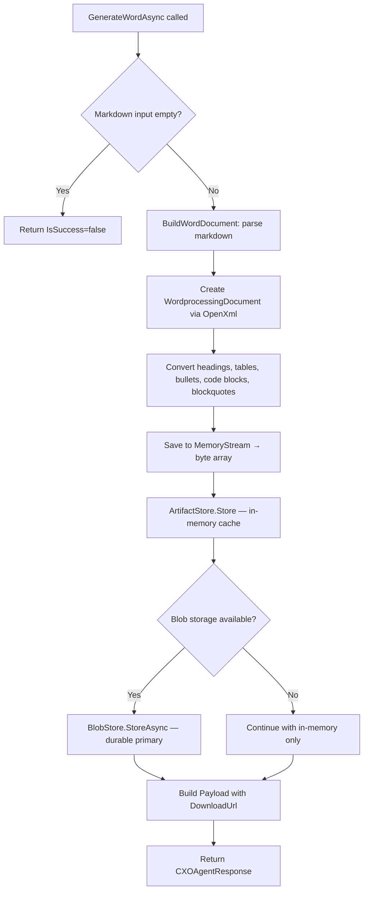
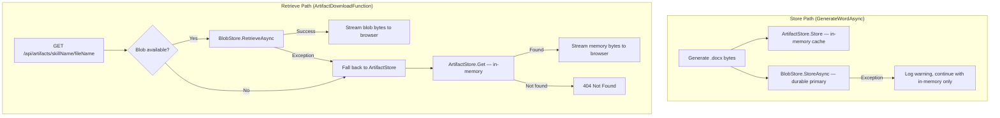

# CXO-AI — Reporting Skill Technical Specification

> **Scope**: Word (.docx) export implemented. Excel, PDF, Email, Teams, PPT are TODO.
> **Framework**: .NET 10 · Azure Durable Functions · OpenXml
> **Branch**: `Reporting-Changes`

---

## 1. High-Level Architecture

CXO-AI is an **agentic orchestration platform** built on Azure Durable Functions. A user prompt enters via HTTP, gets classified, decomposed into a task plan, and executed by specialized **Skills** — each an autonomous LLM agent with its own tools.



### Solution Structure

| Project | Purpose |
|---|---|
| `Functions/CXOAI` | Azure Functions host — HTTP triggers, Durable orchestrators, artifact download endpoint |
| `Common/Services/SkillFramework` | Core: `SkillOrchestrator`, `OrchestratorStepService`, `ArtifactStore`, `CXOAgentResponse` |
| `Common/Services/ConfigurationStoreService` | Skill/Tool config via Azure AI Search index + `SeedData.json` |
| `Common/Services/ConversationStoreService` | Conversation history (Cosmos DB in prod, in-memory for console) |
| `Common/Services/MemoryService` | Long-term user memory with embeddings |
| `Tools/CXOAI` | Tool implementations — `AspectTools`, `ReportingTools`, `NLTKqlTools` |
| `UtilityApps/CXOAI/CXOAIConsole` | Local console orchestrator for dev/testing |
| `UtilityApps/CXOAI/SkillTester` | Isolated single-skill testing harness |
| `UnitTests/CXOAI/UnitTests` | xUnit tests |

### Registered Skills

| Skill | Tools | Purpose |
|---|---|---|
| **AspectSkill** | `AspectRequestCreatorAsync`, `GetAspectResultAsync` | Fetches a single metric (CSAT, Consumption, etc.) for one entity |
| **ReportingSkill** | `GetReportingTemplatesAsync`, `GenerateWordAsync`, `GenerateExcelAsync`, `SendEmailAsync`, `GeneratePdfAsync` | Generates documents / sends emails from upstream data |
| **NLTKqlSkill** | `GetKqlQuery`, `ExecuteQueryAsync` | Translates natural language → KQL, executes against ADX |

---

## 2. Orchestration Flow

### End-to-End Pipeline



### Reporting Skill Data Flow (TC-1: "CSAT for Walmart… export to Word")



---

## 3. Reporting Skill & Tools

### Capability Matrix

| Format | Tool | Status |
|---|---|---|
| **Word (.docx)** | `GenerateWordAsync` | ✅ Implemented — OpenXml, full markdown → .docx conversion |
| Excel (.xlsx) | `GenerateExcelAsync` | ⬜ TODO — placeholder returns UTF-8 bytes |
| PDF | `GeneratePdfAsync` | ⬜ TODO — placeholder returns UTF-8 bytes |
| Email | `SendEmailAsync` | ⬜ TODO — placeholder returns confirmation string |
| PowerPoint (.pptx) | — | ⬜ TODO — no tool entry yet |
| Teams message | — | ⬜ TODO — no tool entry yet |

### Word Export — How It Works



**Payload returned to UI:**

```json
{
  "FileName": "Report_20250715_143022_a1b2c3d4.docx",
  "DownloadUrl": "/api/artifacts/ReportingSkill/Report_20250715_143022_a1b2c3d4.docx",
  "ContentType": "application/vnd.openxmlformats-officedocument.wordprocessingml.document",
  "SizeBytes": 12450
}
```

> **Note:** Blob URIs and storage details are logged server-side only and not returned in the payload. The UI uses `DownloadUrl` (the stable API path) exclusively.
```

### Supported Markdown Elements

Headings (H1–H4), bold, italic, bold+italic, inline code, tables (pipe-delimited), bullet lists, nested bullets, numbered lists, blockquotes, fenced code blocks (with language label), horizontal rules, links, images (as text placeholders).

---

## 4. Document Storage — Current Implementation

### Storage Strategy: Blob Primary + In-Memory Fallback ✅

Artifacts are written to **both** Azure Blob Storage (durable, cross-instance) and the in-memory `ArtifactStore` (`ConcurrentDictionary`) using the **same key** (`{SkillName}/{fileName}`). On retrieval, the download endpoint tries blob first and falls back to in-memory if blob is unavailable or throws an exception.



**Key consistency:** Both stores use the same key format `"{SkillName}/{fileName}"` (e.g., `ReportingSkill/Report_20250715_143022_a1b2c3d4.docx`), ensuring no key mismatch between blob and in-memory lookups.

### Components

| Component | Role | Registration |
|---|---|---|
| `ArtifactStore` | In-memory `ConcurrentDictionary` cache — same-session fallback | Singleton |
| `BlobReportStore` (`IReportBlobStore`) | Azure Blob Storage — durable primary store | Singleton |
| `ArtifactDownloadFunction` | `GET /api/artifacts/{skillName}/{fileName}` — blob-first, memory-fallback | HTTP Trigger |

```csharp
// ArtifactStore — in-memory, registered as singleton
public class ArtifactStore
{
    private readonly ConcurrentDictionary<string, Artifact> _artifacts = new();
    public string Store(skillName, key, bytes, contentType) → "artifact://{skillName}/{key}"
    public Artifact? Get(artifactKey) → lookup by key
}
```

**Download endpoint** (`Functions/CXOAI/Triggers/ArtifactDownloadFunction.cs`):

```
GET /api/artifacts/{skillName}/{fileName}
→ Try BlobStore.RetrieveAsync("{skillName}/{fileName}")
→ On success: 200 OK + Content-Type + Content-Disposition: attachment + blob bytes
→ On exception or blob unavailable: fall back to ArtifactStore.Get("{skillName}/{fileName}")
→ On fallback success: 200 OK + memory bytes
→ Neither found: 404 Not Found
```

### In-Memory Store Lifecycle

| Concern | Behaviour |
|---|---|
| **Cleanup** | No automatic TTL or eviction — entries live until process recycle |
| **Azure Functions (Consumption/Flex)** | Host recycled after ~20 min idle — memory cleared implicitly |
| **Azure Functions (Premium/Dedicated)** | Host stays alive longer — dictionary grows but blob is the durable source of truth |
| **New deployment / scale-in** | Memory cleared — blob survives |
| **Cross-instance** | Each instance has its own `ConcurrentDictionary` — blob is the shared store |

> **Design note:** For this POC the in-memory store has no eviction policy. In production, consider adding TTL-based cleanup or a max-entry cap if memory pressure is observed.

### Why This Approach

| Concern | Behaviour |
|---|---|
| **Durability** | Blob survives restarts, scale events, and multi-instance deployments |
| **Availability** | In-memory fallback ensures downloads work even if blob is temporarily unreachable |
| **Auth** | Downloads go through the API endpoint (same middleware auth) — no SAS tokens or CORS |
| **Link stability** | `DownloadUrl` is a stable `/api/artifacts/...` path — never expires |
| **Simplicity** | No interface extraction needed — `ArtifactStore` stays as-is, `IReportBlobStore` handles blob |

---

## 5. Changes Made — Word Export POC

### Files Changed

| File | Change | Impact |
|---|---|---|
| **`Tools/CXOAI/IReportBlobStore.cs`** | Interface for blob storage: `StoreAsync` (upload) and `RetrieveAsync` (download). Injected as optional dependency. | Blob abstraction |
| **`Tools/CXOAI/BlobReportStore.cs`** | `IReportBlobStore` implementation using Azure Blob Storage with managed identity (`TokenCredential`). Reads `ReportBlobStorageAccountName` and `ReportBlobContainerName` from config. | Blob storage |
| **`Tools/CXOAI/ReportingTools.cs`** | Orchestration-only: `GenerateWordAsync` stores to both in-memory `ArtifactStore` and `IReportBlobStore` (blob primary, memory fallback). Builds payload with `DownloadUrl` only (no `ArtifactRef`). `GetReportingTemplatesAsync` provides rich Word template. Delegates .docx generation to `WordDocumentBuilder.Build()`. Filenames include GUID suffix for hyperscale collision safety. TODO markers on Excel/PDF/Email. | Core feature |
| **`Tools/CXOAI/WordDocumentBuilder.cs`** | Extracted from `ReportingTools.cs` — single-responsibility markdown → .docx converter using OpenXml. Supports H1–H4, tables, bullets, numbered lists, blockquotes, fenced code blocks, horizontal rules, inline formatting. Uses centralized `Styles` constants. | Modularization |
| **`Tools/CXOAI/ReportingModels.cs`** | Extracted input models (`WordToolInput`, `ExcelToolInput`, `PdfToolInput`, `EmailToolInput`, `ReportingTemplateInput`) and `ReportingDocumentType` enum into a dedicated file. Removed duplicate definitions from `ReportingTools.cs`. | Modularization |
| **`Functions/CXOAI/Triggers/ArtifactDownloadFunction.cs`** | HTTP trigger: `GET /api/artifacts/{skillName}/{fileName}`. Tries blob storage first; falls back to in-memory `ArtifactStore` on exception. Streams artifact bytes with `Content-Disposition: attachment`. | Download endpoint |
| **`Functions/CXOAI/Program.cs`** | Fixed tool dictionary key `"ReportingTool"` → `"ReportingTools"` to match SeedData prefix. Registered `ArtifactStore` singleton. Reads `WEBSITE_HOSTNAME` env var and injects `serviceBaseUrl` into `ReportingTools` for complete download URLs. | Runtime fix + URL resolution |
| **`UtilityApps/CXOAI/CXOAIConsole/Program.cs`** | Same dictionary key fix `"ReportingTool"` → `"ReportingTools"`. | Runtime bug fix |
| **`UtilityApps/CXOAI/SkillTester/Skills/ReportingSkillTester.cs`** | Fixed `_artifactStore` field never assigned (NullRef bug). Loads imitated test data, injects as upstream context, writes generated `.docx` to disk. | Bug fix + test harness |
| **`Common/Services/ConfigurationStoreService/StoreConfigs/SeedData.json`** | Tool prefix fixed to `"ReportingTools."` across all 5 tool entries. | Config fix |
| **`Tools/CXOAI/CXOAIToolsService.csproj`** | Added `DocumentFormat.OpenXml 3.3.0` NuGet. | Dependency |
| **`UnitTests/CXOAI/UnitTests/ReportingToolsWordExportTests.cs`** | 7 tests covering: valid .docx generation, payload structure, DownloadUrl → artifact resolution (simulated browser download), disk write, integration download endpoint, empty-input edge case, 404 for missing artifacts. | Test coverage |
| **`UnitTests/CXOAI/UnitTests/BlobReportStoreTests.cs`** | 5 tests covering: blob upload with correct key/content type, payload contains `BlobUri`, retrieve from blob returns valid .docx, non-existent key returns null, fallback from cleared memory to blob. Uses `FakeBlobStore` (in-memory fake). | Blob test coverage |

### Schema Changes

| Type | Status |
|---|---|
| `CXOAgentResponse` | Unchanged — `Payload` (JObject) carries download metadata |
| `Artifact` | Unchanged |
| `ArtifactStore` | Unchanged — used as in-memory fallback alongside `IReportBlobStore` |
| `IReportBlobStore` | **New** — interface: `StoreAsync(blobName, data, contentType)` and `RetrieveAsync(blobName)` |
| `BlobReportStore` | **New** — implements `IReportBlobStore` using `BlobContainerClient` with managed identity |
| `ReportingTools` | **Changed** — `GenerateWordAsync` stores to both blob and in-memory with the same key. Payload contains only `DownloadUrl`, `FileName`, `ContentType`, and `SizeBytes`. Blob URI is logged server-side but not returned to the client. |
| `WordToolInput` | Unchanged (moved to `ReportingModels.cs`) |
| `ReportingTemplateInput` | Unchanged (moved to `ReportingModels.cs`) |
| `ReportingDocumentType` | Unchanged (moved to `ReportingModels.cs`) |

### Download URL Resolution

`ReportingTools` runs inside a Durable Functions activity — it has no `HttpRequestData` or `HttpContext`. The service base URL is resolved at startup from the `WEBSITE_HOSTNAME` environment variable (auto-set by Azure App Service / Azure Functions) and injected via constructor:

```csharp
// Program.cs — reads Azure-provided hostname
var serviceBaseUrl = Environment.GetEnvironmentVariable("WEBSITE_HOSTNAME") is { Length: > 0 } host
    ? $"https://{host}"
    : "";

builder.Services.AddScoped<ReportingTools>(sp =>
    new ReportingTools(..., serviceBaseUrl));
```

| Environment | `WEBSITE_HOSTNAME` | `DownloadUrl` in Payload |
|---|---|---|
| **Azure (deployed)** | `cxoai-func.azurewebsites.net` | `https://cxoai-func.azurewebsites.net/api/artifacts/ReportingSkill/Report_...docx` |
| **Local dev / tests** | Not set | `/api/artifacts/ReportingSkill/Report_...docx` (relative) |

The UI treats `DownloadUrl` as an opaque, clickable link — no base URL configuration needed on the client side.

### Filename Format

Filenames include a timestamp + 8-character GUID suffix for hyperscale collision safety:

```
Report_20250715_143022_a1b2c3d4.docx
       ──────────────── ────────
         timestamp        GUID fragment (first 8 hex chars)
```

- **Timestamp**: human-readable, sortable by date in file explorers and blob storage
- **GUID suffix**: prevents collisions when concurrent requests land in the same second (~4 billion unique values per second)

### Test Results

```
7/7 Passed

✅ TC1_WalmartCSAT_GenerateWordAsync_ProducesValidDocx
✅ TC1_WordExport_PayloadArtifactRef_IsDownloadable
✅ TC1_WordExport_SaveToDisk_AndReturnDownloadUrl
✅ DownloadUrl_ResolvesToValidDocx_SimulatingBrowserDownload
✅ Integration_DownloadEndpoint_ProducesOpenableDocxFile
✅ GenerateWordAsync_EmptyMarkdown_ReturnsFailure
✅ DownloadUrl_NonExistentArtifact_ReturnsNull
```

### What the User Sees

```
✅ Word report generated for Walmart — Support CSAT summary (last 30 days).

📄 Report_20250715_143022_a1b2c3d4.docx
   Word Document — 12.4 KB
   [⬇ Download]       ← hits https://{host}/api/artifacts/ReportingSkill/Report_20250715_143022_a1b2c3d4.docx
```

---

## 6. Demo Test Cases

These are the two prompts the demo must handle end-to-end:

| # | User Prompt | Expected Behaviour |
|---|---|---|
| **TC-1** | *"What does Support CSAT look like for Walmart over the last 30 days, why is it trending that way, and can you export an executive-ready summary to a Word document?"* | Orchestrator selects **AspectSkill → ReportingSkill**. AspectSkill fetches CSAT data. ReportingSkill calls `GetReportingTemplatesAsync(Word)`, LLM fills the template, then calls `GenerateWordAsync`. Response includes a **download link** to the `.docx` file and a chat summary. |
| **TC-2** | *"Give me a quick summary of Walmart & export to doc."* | Same pipeline. The word "doc" triggers ReportingSkill selection. AspectSkill fetches available metrics. ReportingSkill generates a Word document with whatever data was returned. Download link + summary in chat. |

### Orchestrator Path (both test cases)

```
Intent:  DataAction
Skills:  [AspectSkill, ReportingSkill]
DAG:     ReportingSkill depends on [AspectSkill]
Order:   AspectSkill → ReportingSkill

AspectSkill output → fed as "Input from upstream skills" to ReportingSkill
ReportingSkill calls: GetReportingTemplatesAsync → GenerateWordAsync
```

### TC-1: Expected Chat Output

```
✅ Word report generated for Walmart — Support CSAT summary (last 30 days).

📄 Walmart_CSAT_Summary_20250715.docx
   Word Document — 12.4 KB
   [⬇ Download]
```

### TC-2: Expected Chat Output

```
✅ Word report generated for Walmart — Quick summary.

📄 Walmart_Summary_20250715.docx
   Word Document — 8.2 KB
   [⬇ Download]
```
