# CXOAI Orchestrator — Architecture & Data Flow

## Overview

The CXOAI Orchestrator is an AI-powered multi-agent system that processes user prompts through a pipeline of LLM agents. It runs in two modes:

| | Console App (`SkillOrchestrator.RunAsync`) | Azure Functions (`CxoaiOrchestrator` + Durable Tasks) |
|---|---|---|
| **Entry point** | `SkillOrchestrator.RunAsync(userId, prompt, userContext?, sessionId?)` | `POST /api/orchestrate` → `OrchestratorMain` |
| **Configuration** | `TreeJsonConfigurationStoreProvider` (local JSON) | `TreeConfigurationStoreProvider` (Azure AI Search index) |
| **Memory** | `FileMemoryStore` (local JSON file) | `CosmosMemoryStore` (Cosmos DB with vector search) |
| **Knowledge graph** | `KnowledgeGraphTools` — text match + LLM fallback (`gpt-4o`) on `KnowledgeGraph.json` | Same (bundled in output) |
| **Conversation history** | `InMemoryConversationStore` (in-process dictionary) | `InMemoryConversationStore` (swap to Cosmos for prod) |
| **Status notifications** | `ConsoleStatusNotifier` → prints to terminal | `SignalRStatusNotifier` → pushes via Azure SignalR Service |
| **User input** | `Console.ReadLine()` via `IStatusNotifier` | `WaitForExternalEvent` + `POST /api/instances/{id}/skills/{name}/input` |
| **Access token** | N/A | `OrchestratorInput.AccessToken` → `IUserAuthContext` (scoped per activity) |

---

## End-to-End Flow (Mermaid)

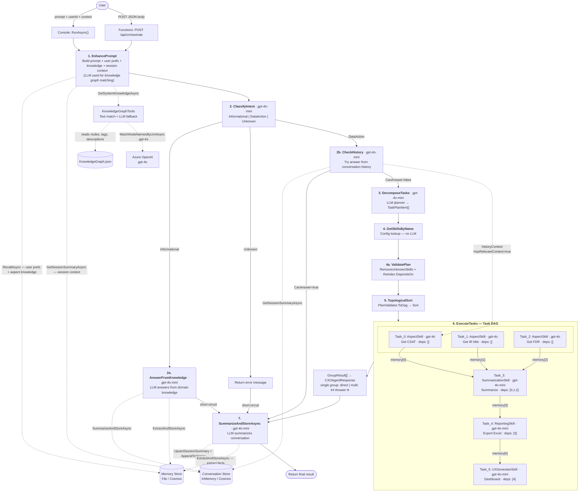

> **Reading guide:** Solid arrows (`→`) = pipeline control flow. Dashed arrows (`-.->`) = read/write to persistent stores or LLM calls. The DAG in Step 6 shows `memory[idx]` flowing from each completed task to its dependents.
>
> **Model key:** Pipeline steps use `gpt-4o-mini` (`_secondaryModelName` from `AzureOpenAIModelNameV2`). Knowledge graph node matching uses `gpt-4o` (via `KnowledgeGraphTools.MatchNodeNamesByLlmAsync`). Skill execution uses per-skill `ModelName` from `Skills.json` — e.g. AspectSkill uses `gpt-4o`.

---

## Skills & Tools Map

Each skill is an LLM agent with a system prompt and a set of tools from the `CXOAIToolsService` project (`Tools\CXOAI\`). The planner in Step 3 selects skills; the agent in Step 6 calls tools via function-calling.

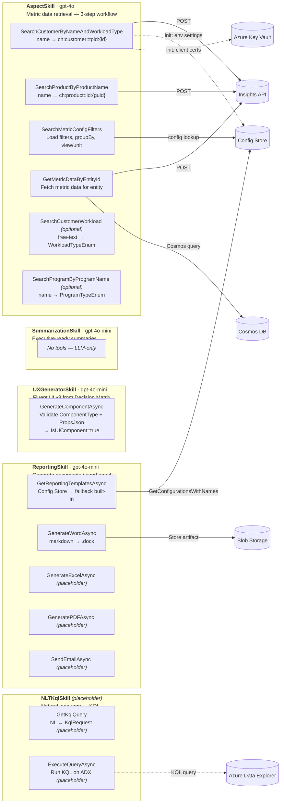

### Skill Summary

| Skill | Model | Tools (from `CXOAIToolsService`) | Description |
|---|---|---|---|
| **AspectSkill** | `gpt-4o` | `AspectTools` (6 methods) | 3-step workflow: resolve entity (customer/product) → load metric config (filters, groupBy, view) → fetch metric data from Insights API or Cosmos DB |
| **ReportingSkill** | `gpt-4o-mini` | `ReportingTools` (5 methods) | Retrieve template → generate document (Word fully implemented; Excel/PDF/Email placeholders) → store artifact to Blob |
| **UXGeneratorSkill** | `gpt-4o-mini` | `UXGeneratorTool` (1 method) | LLM selects Fluent UI v8 component from Decision Matrix, builds props JSON from upstream data, calls `GenerateComponentAsync` once |
| **SummarizationSkill** | `gpt-4o-mini` | *(none — LLM-only)* | Condenses upstream data into executive-ready summaries with trend analysis, cross-entity correlation, and recommendations |
| **NLTKqlSkill** | *(placeholder)* | `NLTKqlTools` (2 methods) | Natural language → KQL query generation + execution on Azure Data Explorer *(not yet implemented)* |

### Tool Details — AspectTools Workflow

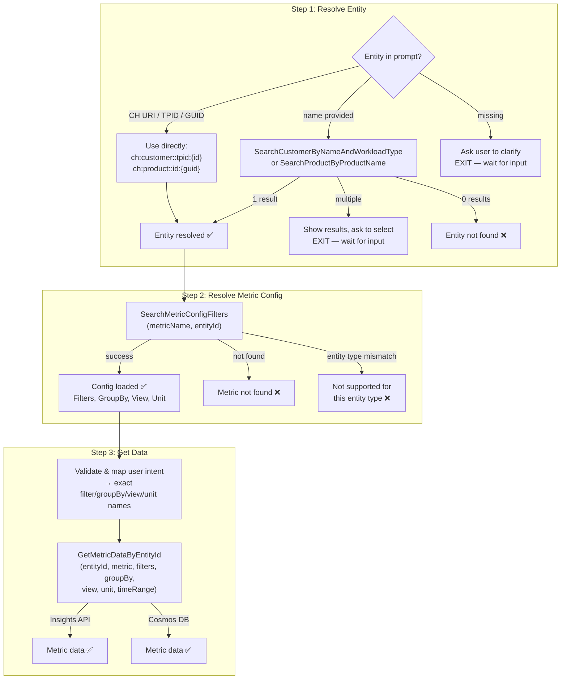

---

## External System Interactions

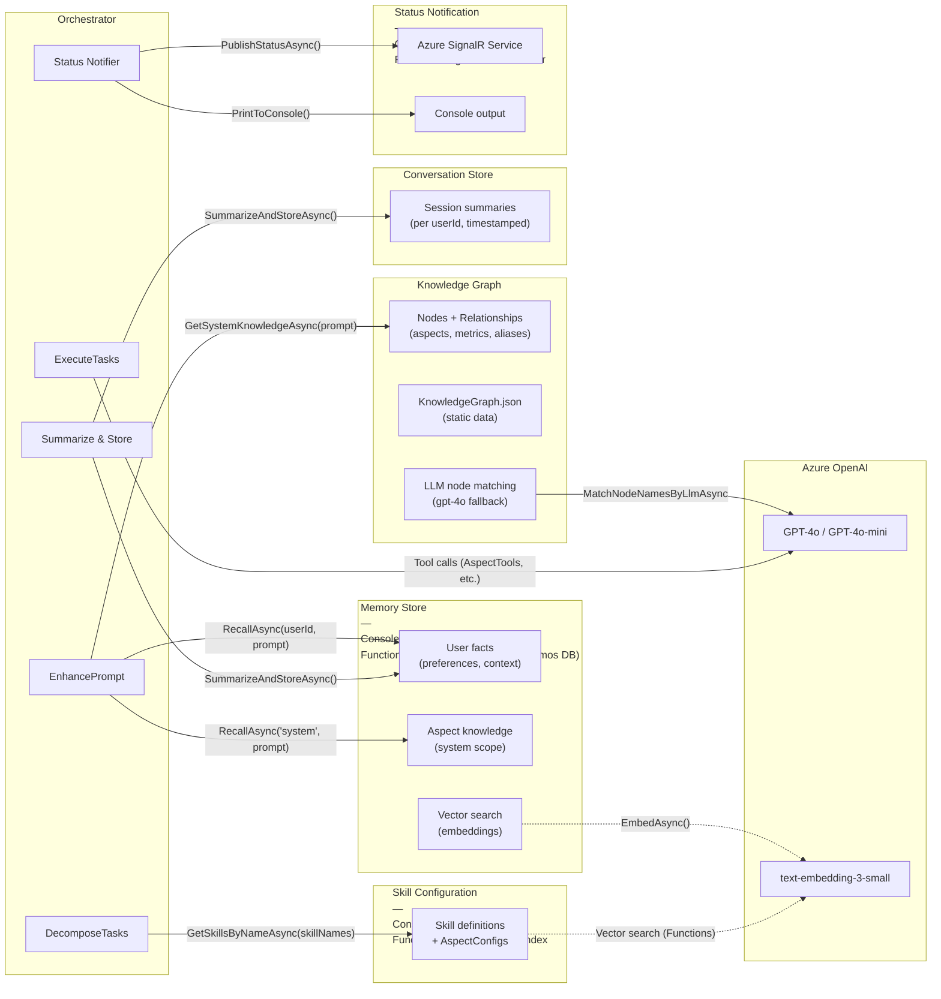

---

## Step-by-Step Data Flow

```mermaid
sequenceDiagram
    actor User
    participant Entry as Console / HTTP Trigger
    participant Orch as Orchestrator
    participant Memory as Memory Store<br/>(JSON / Cosmos DB)
    participant KG as KnowledgeGraphTools
    participant Config as Configuration Store<br/>(JSON / Search Index)
    participant LLM as Azure OpenAI
    participant Conv as Conversation Store
    participant Notifier as Status Notifier<br/>(Console / SignalR)
    participant UI as Client / UI

    User->>Entry: prompt + userId + userContext + sessionId?
    Entry->>Orch: RunAsync / OrchestratorMain

    Note over Orch: Step 1: EnhancePrompt
    Orch->>Notifier: BeginStep("EnhancePrompt")
    Notifier-->>UI: ReceiveStatus (Running)
    Orch->>Memory: RecallAsync(userId, prompt, scope=User)
    Memory-->>Orch: user preference facts
    Orch->>Memory: RecallAsync("system", prompt, scope=Aspect)
    Memory-->>Orch: aspect knowledge facts
    Orch->>KG: GetSystemKnowledgeAsync(prompt)
    KG->>KG: MatchNodeNamesByText(prompt)
    alt residual or no text matches
        KG->>LLM: MatchNodeNamesByLlmAsync(prompt) · gpt-4o
        LLM-->>KG: matched node names
    end
    KG-->>Orch: matched nodes + relationships
    Note right of Orch: UserContext handled inside EnhancePrompt<br/>(no separate Step 0)
    Orch->>Notifier: CompleteStep("EnhancePrompt")
    Notifier-->>UI: ReceiveStatus (Completed)

    Note over Orch: Step 2: ClassifyIntent (BEFORE history check)
    Orch->>Notifier: BeginStep("ClassifyIntent")
    Notifier-->>UI: ReceiveStatus (Running)
    Orch->>LLM: Classify: Informational | DataAction | Unknown
    LLM-->>Orch: UserIntent
    Orch->>Notifier: CompleteStep("ClassifyIntent")
    Notifier-->>UI: ReceiveStatus (Completed)

    alt Informational
        Orch->>LLM: AnswerFromKnowledgeAsync(prompt, generalKnowledge)
        Orch->>Conv: SummarizeAndStoreAsync()
        Notifier-->>UI: ReceiveCompleted (Functions only)
        Orch-->>User: Return knowledge answer
    else Unknown
        Orch->>Conv: SummarizeAndStoreAsync()
        Notifier-->>UI: ReceiveCompleted (Functions only)
        Orch-->>User: Return error message
    else DataAction
        Note over Orch: Continue to history check...
    end

    Note over Orch: Step 2a: CheckHistory (DataAction only)
    Orch->>Notifier: BeginStep("CheckHistory")
    Notifier-->>UI: ReceiveStatus (Running)
    Orch->>Conv: GetSessionSummaryAsync(userId, sessionId)
    Conv-->>Orch: session summary (if any)
    Orch->>LLM: Can this be answered from history?
    LLM-->>Orch: HistoryAnswerResult

    alt CanAnswer = true
        Orch->>Conv: SummarizeAndStoreAsync()
        Notifier-->>UI: ReceiveCompleted (Functions only)
        Orch-->>User: Return answer (short-circuit)
    else HasRelevantContext = true
        Note over Orch: Carry historyContext forward into pipeline
    end
    Orch->>Notifier: CompleteStep("CheckHistory")
    Notifier-->>UI: ReceiveStatus (Completed)

    Note over Orch: Step 3: DecomposeTasks (single LLM call)
    Orch->>Notifier: BeginStep("DecomposeTasks")
    Notifier-->>UI: ReceiveStatus (Running)
    Orch->>Config: Load skill descriptions for planner system prompt
    Config-->>Orch: skill descriptions
    Orch->>LLM: Decompose prompt into task plan
    LLM-->>Orch: List of TaskPlanItem (group, skill, deps, promptToSend)
    Orch->>Notifier: CompleteStep("DecomposeTasks")
    Notifier-->>UI: ReceiveStatus (Completed)

    Note over Orch: Step 4: GetSkillsByName (config lookup, no LLM)
    Orch->>Config: GetSkillsByNameAsync(uniqueSkillNames)
    Config-->>Orch: List of AgentSkill configs

    Note over Orch: Step 4a: ValidatePlan (Console only, no LLM)
    Note right of Orch: PlanValidator.RemoveUnknownSkillsAndReindex<br/>removes unknown skills and re-indexes DependsOn

    Note over Orch: Step 5: TopologicalSort (no I/O)
    Note over Orch: PlanValidator.ToDag() then TopologicalSort.Sort()

    Note over Orch: Step 6: ExecuteTasks
    Orch->>Notifier: BeginStep("ExecuteTasks")
    Notifier-->>UI: ReceiveStatus (Running)
    loop For each task in topological order
        Orch->>Notifier: BeginSkill("Task_{idx}", "[skill] task label (model: ...)")
        Notifier-->>UI: ReceiveStatus (task Running)

        alt Console App
            Note right of Orch: GenerateSkillPromptAsync (LLM call):<br/>1. LLM scopes user query to this task<br/>2. Code appends structured fields from ExpectedSkillInput<br/>(aspectName, uiContext, domainKnowledge, factualData)
            Orch->>LLM: Scope prompt to task
            LLM-->>Orch: focused prompt
        else Functions App
            Note right of Orch: Direct assembly:<br/>task.PromptToSend<br/>+ ## Input from upstream tasks (dep outputs)<br/>+ domain knowledge (for downstream tasks only)<br/>+ history context (for root tasks only)
        end

        Orch->>LLM: Run agent with tools
        LLM->>LLM: Tool calls (AspectTools, ReportingTools, etc.)

        alt NeedsUserInput = true (max 5 rounds)
            Orch->>Notifier: SkillNeedsInput("Task_{idx}", question, round)
            Notifier-->>UI: ReceiveUserInputRequest

            alt Functions App
                Note over Orch: NotifyUserInputNeededActivity → SignalR<br/>(returns false if SignalR not configured → breaks)
            end

            Note over Orch: Console: WaitForUserInputAsync()<br/>Functions: WaitForExternalEvent("UserInput_{skillName}") + 5-min timeout
            User->>Entry: user response
            Entry->>Orch: resume with input
            Orch->>LLM: Re-execute with base prompt + user response (round N)
        end

        Note right of Orch: memory[taskIndex] = result<br/>(keyed by index, not skill name)
        Orch->>Notifier: CompleteSkill("Task_{idx}")
        Notifier-->>UI: ReceiveStatus (task Completed)
    end

    Note right of Orch: Assemble per-group GroupResult[]<br/>Merge into CXOAgentResponse

    Orch->>Notifier: CompleteStep("ExecuteTasks")
    Notifier-->>UI: ReceiveStatus (Completed)

    Note over Orch: Step 7: Summarize & Store
    Orch->>Conv: SummarizeAndStoreAsync(userId, sessionId, sessionMessages)
    Note right of Conv: Stores conversation summary<br/>+ extracts facts to memory

    Notifier-->>UI: ReceiveCompleted (Functions only)
    Orch-->>User: Return final result
```

---

## Configuration Store Flow

The configuration store holds skill definitions (name, description, tools, model, system prompt) and aspect configurations.

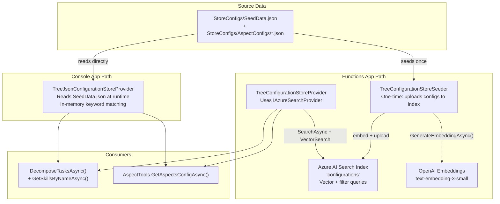

### Environment Settings (Functions)

| Setting | Used By | Purpose |
|---|---|---|
| `SearchServiceEndpoint` | `AzureSearchProvider` | Azure AI Search service URL |
| `SearchIndexName` | `AzureSearchProvider` | Index containing skill configurations |
| `EmbeddingDeployment` | `TreeConfigurationStoreProvider` | OpenAI embedding model for vector queries |
| `AzureOpenAIEndpoint` | All LLM calls + embeddings | Azure OpenAI resource URL |

---

## Memory Store Flow

The memory store provides long-term user preferences and domain knowledge via vector similarity search.

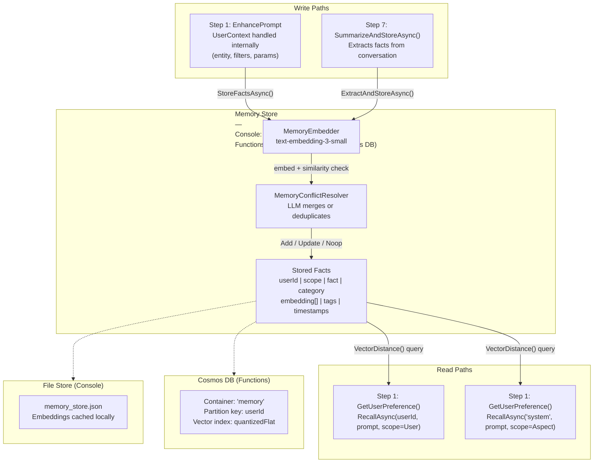

### Environment Settings (Functions — Cosmos)

| Setting | Path in JSON | Purpose |
|---|---|---|
| Account endpoint | `cosmosDbsMaps:MemoryStoreDB:accountEndpoint` | Cosmos DB account URL |
| Database | `cosmosDbsMaps:MemoryStoreDB:databaseId` | Database name (e.g., `cxoai`) |
| Container | `cosmosDbsMaps:MemoryStoreDB:containerId` | Container for memory facts (e.g., `memory`) |
| Lease DB | `cosmosDbsMaps:MemoryStoreDB:leaseDatabaseId` | Change feed lease database |
| Lease container | `cosmosDbsMaps:MemoryStoreDB:leaseContainerId` | Change feed lease container |

---

## Status Notification Flow

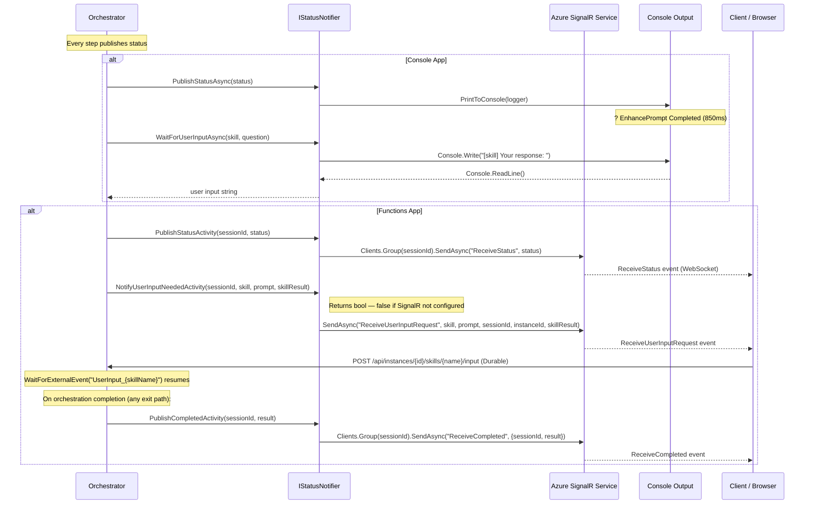

### SignalR Endpoints (Functions)

| Endpoint | Method | Purpose |
|---|---|---|
| `/api/negotiate?sessionId={id}` | POST | Returns SignalR connection info, adds client to session group |
| `/api/instances/{id}/skills/{name}/input` | POST | Durable Functions external event — raises `UserInput_{skillName}` for the orchestrator |

### SignalR Hub Events (pushed to client)

| Event | Payload | When |
|---|---|---|
| `ReceiveStatus` | `OrchestratorStatus` (full snapshot) | Every `BeginStep` / `CompleteStep` / `BeginSkill` / `CompleteSkill` / `SkillNeedsInput` / `FailStep` |
| `ReceiveUserInputRequest` | `skillName`, `prompt`, `sessionId`, `instanceId`, `skillResult` | When a skill needs user input |
| `ReceiveCompleted` | `{ sessionId, result: CXOAgentResponse }` | When the orchestration finishes (success, error, or short-circuit) |

---

## Skill Execution Detail

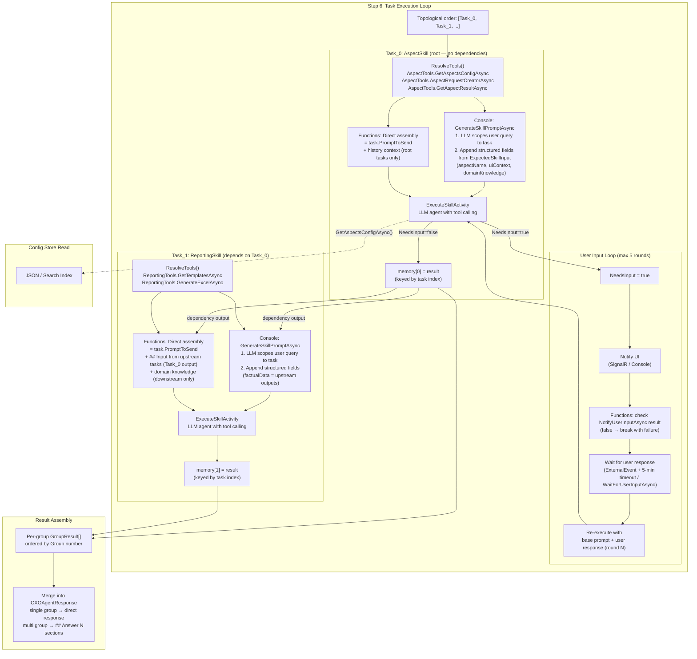

---

## Conversation History Flow

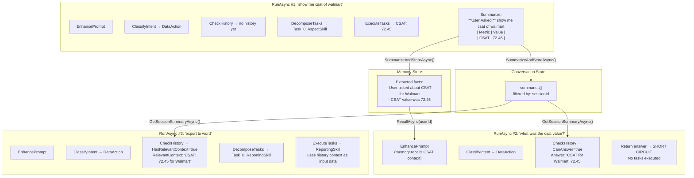

---

## Environment Configuration Structure

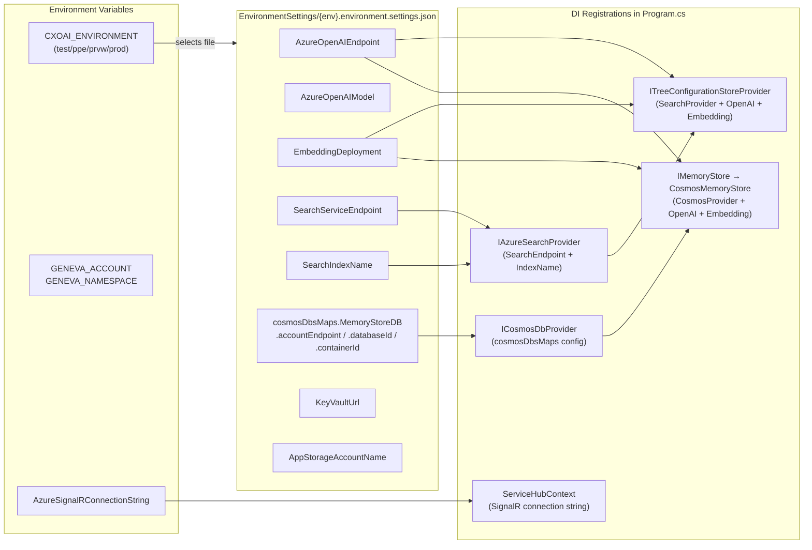

### Sample: `test.environment.settings.json`

```json
{
  "AzureOpenAIEndpoint": "https://your-openai-test.openai.azure.com/",
  "AzureOpenAIModel": "gpt-4o-mini",
  "EmbeddingDeployment": "text-embedding-3-small",
  "SearchServiceEndpoint": "https://your-search-test.search.windows.net",
  "SearchIndexName": "configurations",
  "KeyVaultUrl": "https://your-kv-test.vault.azure.net/",
  "ApplicationInsightsConnectionString": "",
  "cosmosDbsMaps": {
    "MemoryStoreDB": {
      "databaseId": "cxoai",
      "containerId": "memory",
      "leaseDatabaseId": "cxoai",
      "leaseContainerId": "memory-leases",
      "accountEndpoint": "https://your-cosmos-test.documents.azure.com:443/"
    }
  }
}
```

---

## Console → Functions Implementation Mapping

| Concern | Console App | Functions App |
|---|---|---|
| **Orchestrator** | `SkillOrchestrator.RunAsync()` (single method) | `CxoaiOrchestrator.OrchestratorMain` + `SkillExecutionSubOrchestrator` |
| **Step execution** | Direct `await` calls in `RunAsync` via `IOrchestratorStepService` | `context.CallActivityAsync()` per step |
| **Task decomposition** | `_stepService.DecomposeTasksAsync()` → `List<TaskPlanItem>` | `DecomposeTasksActivity` → `List<TaskPlanItem>` |
| **Skill config lookup** | `_stepService.GetSkillsByNameAsync(names)` | `GetSkillsByNameActivity(names)` |
| **Plan validation** | `PlanValidator.RemoveUnknownSkillsAndReindex()` (removes unknown skills, re-indexes DependsOn) | `PlanValidator.ToDag()` only (no unknown-skill removal in orchestrator) |
| **Prompt generation** | `GenerateSkillPromptAsync()` per task — LLM scopes query + appends structured fields from `ExpectedSkillInput` | Direct `task.PromptToSend` + manual assembly of upstream outputs, domain knowledge, and history context |
| **Task loop** | `foreach` with `await ExecuteSkillAsync()` per task | `CallSubOrchestratorAsync` → `foreach` + `CallActivityAsync` per task |
| **Execution memory** | `Dictionary<string, CXOAgentResponse>` (keyed by task index) | `Dictionary<string, SkillExecutionResult>` (keyed by task index) |
| **Result assembly** | Per-group `GroupResult[]` merged into `CXOAgentResponse` | Per-group `GroupResult[]` merged into `CXOAgentResponse` |
| **State** | `OrchestratorState` (in-memory cache with `TryGet`/`Set`) | Durable orchestrator checkpoint (automatic) |
| **Config store** | `TreeJsonConfigurationStoreProvider("StoreConfigs/SeedData.json")` | `ITreeConfigurationStoreProvider` via DI (Search index) |
| **Memory store** | `FileMemoryStore` (local JSON + embeddings) | `CosmosMemoryStore` via DI (Cosmos DB vector search) |
| **Conversation store** | `InMemoryConversationStore` | `InMemoryConversationStore` (or `CosmosConversationStore`) |
| **Knowledge graph** | `KnowledgeGraphTools` → `Configuration/KnowledgeGraph.json` | Same (file bundled in output) |
| **Status publish** | `ConsoleStatusNotifier.PrintToConsole()` | `PublishStatusActivity` → SignalR `SendAsync("ReceiveStatus")` |
| **Completed notification** | N/A (return value) | `PublishCompletedActivity` → SignalR `SendAsync("ReceiveCompleted", { sessionId, result })` |
| **User input wait** | `_notifier.WaitForUserInputAsync()` (max 5 rounds) | `WaitForExternalEvent("UserInput_{skillName}")` with 5-min durable timeout (max 5 rounds) |
| **User input notify** | `_notifier.PublishStatusAsync()` with `SkillNeedsInput` | `NotifyUserInputNeededActivity` → SignalR `SendAsync("ReceiveUserInputRequest", skill, prompt, sessionId, instanceId, skillResult)` — returns `bool` (false if SignalR unavailable) |
| **User input submit** | Keyboard input via `IStatusNotifier` | `POST /api/instances/{id}/skills/{name}/input` |
| **Access token** | N/A | `OrchestratorInput.AccessToken` → `ExecuteSkillInput.AccessToken` → `IUserAuthContext.AccessToken` (scoped per activity) |
| **Tool session** | `_stepService.SetToolSession(sessionId)` (once before loop) | `_stepService.SetToolSession(sessionId)` (per `ExecuteSkillActivity`) |
| **Error handling** | Exception propagates to caller | `try/catch` in `OrchestratorMain` + `SkillExecutionSubOrchestrator` → returns `CXOAgentResponse { IsSuccess = false }` + best-effort `PublishCompletedActivity` |
| **Result delivery** | Return `CXOAgentResponse` to caller | `PublishCompletedActivity` via SignalR + Durable Functions status query: `GET /runtime/webhooks/durableTask/instances/{id}` |

---

## Key Design Decisions

| Decision | Reason |
|---|---|
| **Intent classification before history check** | Definitional queries ("what is csat?") go straight to AnswerFromKnowledge without hitting the history store; unknown queries exit immediately |
| **DecomposeTasks replaces 3 LLM calls** | Old pipeline had GetRelevantSkills + GetSkillDAG + GetSkillPrompts (3 LLM calls). New `DecomposeTasksActivity` produces `List<TaskPlanItem>` (group, skill, deps, promptToSend) in a single LLM call |
| **Task-index keyed memory** | Memory is keyed by task index (not skill name) so multiple tasks using the same skill don't overwrite each other |
| **Two config providers (JSON / Search Index)** | Console uses local JSON for fast iteration; Functions uses Search Index for vector-based retrieval at scale |
| **Two memory providers (File / Cosmos)** | Console caches embeddings locally; Functions uses Cosmos DB vector search for production persistence |
| **`IStatusNotifier` abstraction** | Console prints to terminal; Functions pushes via SignalR — same orchestrator code, different notification channel |
| **`IOrchestratorStepService` abstraction** | Console and Functions share the same step logic; only flow control differs (direct `await` vs. `CallActivityAsync`) |
| **Knowledge graph with LLM fallback** | Static domain topology (aspects → metrics → aliases) loaded from `KnowledgeGraph.json`; `KnowledgeGraphTools` first tries text/tag matching, then falls back to `gpt-4o` LLM for semantic node resolution |
| **Memory conflict resolution** | `MemoryConflictResolver` uses LLM to merge/deduplicate facts — prevents contradictory preferences |
| **Conversation history as session summaries** | Session-scoped summaries (per userId + sessionId); summaries are compact (not raw conversation) |
| **TopologicalSort in orchestrator** | Deterministic, no I/O — safe for Durable Functions replay semantics |
| **Sub-orchestrator for task loop** | Isolates `foreach` + `WaitForExternalEvent` pattern — enables independent retry and monitoring |
| **`PublishStatusActivity` (not direct I/O)** | Durable orchestrators can't do I/O — status push must happen in an activity |
| **`PublishCompletedActivity` on every exit path** | Ensures UI always receives a final `ReceiveCompleted` event, even for short-circuit and error paths |
| **SignalR session groups** | Each orchestration instance gets its own group — status updates target only the requesting client |
| **Max 5 user input rounds** | Prevents infinite loops when skills repeatedly request user input |
| **`PlanValidator.RemoveUnknownSkillsAndReindex`** | Safely removes tasks referencing unknown skills and re-indexes all `DependsOn` references to prevent index-shift corruption |
| **Console `GenerateSkillPromptAsync` vs Functions direct assembly** | Console uses an additional LLM call per task to scope the user query + appends structured fields from `ExpectedSkillInput` keywords. Functions uses `task.PromptToSend` directly with manual context assembly for simpler serialization across durable activities |
| **Domain knowledge injection for downstream tasks only (Functions)** | Root tasks already have their prompts from the planner; downstream tasks need domain context (metric definitions, relationships) to interpret upstream data correctly |
| **Access token propagation via `IUserAuthContext`** | Scoped service populated in each `ExecuteSkillActivity` — tools accessing authenticated APIs get the user's bearer token without threading it through every method |
| **Graceful error handling in orchestrators** | Both `OrchestratorMain` and `SkillExecutionSubOrchestrator` wrap their logic in `try/catch`, returning `CXOAgentResponse { IsSuccess = false }` with a user-friendly message via `OrchestratorMessages.GracefulError` |
| **`NotifyUserInputAsync` returns `bool`** | If SignalR is not configured (e.g., local dev), the activity returns `false` and the skill execution breaks out gracefully instead of hanging on `WaitForExternalEvent` forever |
